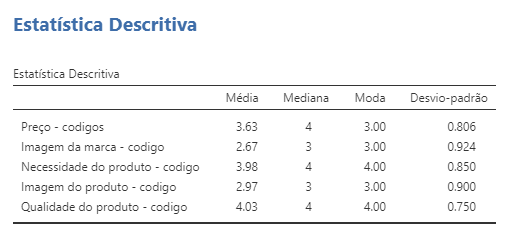

```{r include=FALSE}
library(openxlsx)
library(tidyverse)
library(descr)
library(flextable)
library(moments)
library(paletteer)
library(RColorBrewer)
library(unikn)
library(ggplot2)
library(jmv)
```

## Sumário Executivo

O presente documento traduz a análise de uma base de dados retirada de um questionário denominado 𝘗𝘦𝘳𝘧𝘪𝘭 𝘥𝘦 𝘊𝘰𝘯𝘴𝘶𝘮𝘰 𝘦 𝘊𝘰𝘮𝘱𝘰𝘳𝘵𝘢𝘮𝘦𝘯𝘵𝘰 𝘥𝘦 𝘊𝘰𝘮𝘱𝘳𝘢. Neste documento são abordadas questões relacionadas com os fatores que influenciam a tomada de decisão dos jovens no momento da compra, sendo que os mesmos conduziram o estudo em causa. Para realizar esta pesquisa foram utilizadas diversas plataformas como o R, o Jamovi e o Excel.  

## Introdução

O objetivo da exploração da base de dados foi perceber qual a relevância de um leque de fatores na tomada de decisão da compra de diferentes produtos por parte dos jovens, pelo que fomos investigar se o preço, a imagem do produto, a localização da loja e outros fatores influenciavam a forma de consumo dos jovens. Com este propósito partimos para a investigação das variáveis que poderiam estar relacionadas com o nosso objetivo, estudando-as a nível individual e a nível relacional.

```{r, include=FALSE}

## Pergunta 1 Importação do ficheiro Excel e tratamento dos dados

#Com o propósito de analisar a base de dados utilizando a plataforma de análise estatística R, importamos o ficheiro 𝘊𝘗12_𝘑𝘰𝘷𝘦𝘯𝘴_-_𝘊𝘰𝘱𝘪𝘢_2 do Excel, que consiste na base de dados original com os dados tratados e preparados para que seja possível a análise dos mesmos e a consequente tirada de conclusões.

#Em seguida é possível observar as diferentes variáveis do nosso estudo, sendo que algumas estão organizadas de acordo com a escala de Likert, pelo que têm um código de 1 a 5 ou de nada importante até extremamente importante.


bd <-read.xlsx("CP12_Jovens_-_Copia_2.xlsx")
colnames(bd)

## Pergunta 2 Mudança do nome de duas variáveis

#Para facilitar o estudo das variáveis inicialmente denominadas de "País" (𝘤𝘰𝘶𝘯𝘵𝘳𝘺) e de "agregado" (𝘢𝘨𝘳𝘦𝘨𝘢𝘥𝘰), procedemos à alteração da sua denominação para "País_origem" e "Agregado_familiar", respetivamente.


names(bd)[2] <- c("País_origem")
names(bd)[6] <- c("Agregado_Familiar")

names(bd)[2]
names(bd)[6]

```

## Perfil dos Jovens

Antes de começarmos a analisar as variáveis é necessário conhecer o perfil dos inquiridos e, para isso, iremos analisar alguns dados sobre os mesmos.

A amostra é composta por 1575 indivíduos portugueses e espanhóis dos 18 aos 25 anos. No gráfico 1 é possivel verificar a existência de um maior número de inquiridos com 21 anos.

```{r,echo=FALSE, fig.align='center'}
tab_idade<-table(bd$Idade)
barplot(tab_idade,ylim=c(0,500),col=heat.colors(8), main = "Idade dos inquiridos")
```
*Gráfico 1 - Gráfico de barras sobre a idade dos inquiridos*

Ao observar a tabela 1 percebemos que a média das idades é 21.2. Ao examinar o desvio padrão é possível verificar que este tem o valor de 1.8, um valor razoável, o que  demonstra que a média é um valor fidedigno e com pouca discrepância com os valores reais(isto acontece, pois existe cada vez menos inquiridos quanto mais se afastam da idade mediana que é 21).
Além disso, 25% dos jovens têm entre 18 e 20 anos e 75% dos mesmos têm entre 18 e 22 anos.

```{r, echo=FALSE, fig.align='center'}
# - - idade dados - - - 

bd$Idade[bd$Idade==99] <- NA

n_idade <- length(bd$Idade)
media_idade <- round(mean(bd$Idade,na.rm=TRUE),1)
mediana_idade <- median(bd$Idade,na.rm=TRUE)
desvpadr_idade <- round(sd(bd$Idade, na.rm=TRUE),1)
varianc_idade <- round(var(bd$Idade, na.rm=TRUE),1)
minimo_idade <- min(bd$Idade, na.rm=TRUE)
maximo_idade <- max(bd$Idade, na.rm=TRUE)
firstqt_idade <- round(quantile(bd$Idade, 0.25, na.rm=TRUE),1)
thirdqt_idade <- round(quantile(bd$Idade, 0.75, na.rm=TRUE), 1)
assimetria_idade <- round(skewness(bd$Idade, na.rm=TRUE),1)
curtose_idade <- round(kurtosis(bd$Idade, na.rm=TRUE),1)

# construção da tabela

Valor_idade <- c(n_idade, media_idade,mediana_idade,  desvpadr_idade, varianc_idade, minimo_idade, maximo_idade, firstqt_idade, thirdqt_idade, assimetria_idade, curtose_idade)
Medidas_idade <- c("N", "Média", "Mediana", "Desvio padrão", "Variância", "Mínimo", "Máximo", "1ºQuartil", "3ºQuartil", "Assimetria", "Curtose")
table_agreg_idade_idade <- data.frame(Medidas_idade,Valor_idade)
ftab_agreg_idade <- flextable(table_agreg_idade_idade)

#cor no fundo do cabeçalho - bg
#código de cores
ftab_agreg_idade <- bg(ftab_agreg_idade, bg = "#3895D3", part = "header")

#cor da letra do cabeçalho em branco
ftab_agreg_idade <- color(ftab_agreg_idade, color = "white", part = "header")
ftab_agreg_idade <- autofit(ftab_agreg_idade)

#Um valor a negrito (linha 1)
ftab_agreg_idade <- bold(ftab_agreg_idade,i=1,j=2,bold=TRUE, part="body")

#Um valor com destaque de cor
ftab_agreg_idade <- color(ftab_agreg_idade, i=2, j=2, color="violetred2", part="body")
ftab_agreg_idade
```
*Tabela 1 - Tabela com medidas descritivas sobre a idade dos inquiridos*

Podemos observar no gráfico 2 que a assimetria é positiva, visto que a curva de densidade está a aumentar até ao valor da média. Assimetria positiva que corresponde ao valor da moda ser menor que o da mediana, e menor que o da média.(Moda ≤ Mediana < Média)

```{r,echo=FALSE, fig.align='center'}
hist(bd$Idade,
     col =  cm.colors(7),
     freq = F,
     main = "Idades",
     xlab= "Idades",
     breaks = 6)
curve(dnorm(x, mean = mean(bd$Idade), sd=sd(bd$Idade)), add = T)
```
*Gráfico 2 - Histograma sobre a idade dos inquiridos*

Além disso, a amostra é constuída por 989 mulheres (62.8%) (Tabela 2) e o país com mais representantes é Portugal com 955 participantes (60.6%) (Tabela 3).

```{r, echo=FALSE, fig.align='center'}

# ---Sexo---

Sex_1<-table(bd$Sexo)
Sex_2<-round((prop.table(Sex_1)*100),1)

sexo_total<-table(bd$Sexo)
Percent<-round((prop.table(Sex_1)*100),1)

tab_Sex <- rbind(sexo_total,Percent)


Feminino_n <-as.numeric(Sex_1)[1]
Masculino_n <- as.numeric(Sex_1)[2]

Feminino_p <-as.numeric(Sex_2)[1]
Masculino_p <- as.numeric(Sex_2)[2]

Sexo_inquiridos <- c("Feminino", "Masculino")

n <- c(Feminino_n, Masculino_n)
Percentagem <- c(Feminino_p, Masculino_p)
table_objcompra <- data.frame(Sexo_inquiridos,n,Percentagem)
ftab_sexo <- flextable(head(table_objcompra))

ftab_sexo <- bg(ftab_sexo, bg = "#3895D3", part = "header")

ftab_sexo <- color(ftab_sexo, color = "white", part = "header")
ftab_sexo <- autofit(ftab_sexo) 
ftab_sexo
```
*Tabela 2 - Tabela de frequência sobre o sexo dos inquiridos*

```{r, echo=FALSE, fig.align='center'}

# ---País---

País_1<-table(bd$País_origem)
País_2<-round((prop.table(País_1)*100),1)

País_origem_total<-table(bd$País_origem)
Percent<-round((prop.table(País_1)*100),1)

tab_Sex <- rbind(País_origem_total,Percent)

Espanha_n <-as.numeric(País_1)[1]
Portugal_n <- as.numeric(País_1)[2]

Espanha_p <-as.numeric(País_2)[1]
Portugal_p <- as.numeric(País_2)[2]

País_origem_inquiridos <- c("Espanha", "Portugal")

n <- c(Espanha_n, Portugal_n)
Percentagem <- c(Espanha_p, Portugal_p)
table_objcompra <- data.frame(País_origem_inquiridos,n,Percentagem)
ftab_País_origem <- flextable(head(table_objcompra))

ftab_País_origem <- bg(ftab_País_origem, bg = "#3895D3", part = "header")

ftab_País_origem <- color(ftab_País_origem, color = "white", part = "header")
ftab_País_origem <- autofit(ftab_País_origem) 
ftab_País_origem
```
*Tabela 3 - Tabela de frequência sobre o país de origem dos inquiridos*


O gráfico 3 demonstra que, tanto em Espanha, como em Portugal, existiram mais participantes do sexo feminino do que do sexo masculino.

```{r, echo=FALSE, fig.align='center'}
cc <- ggplot(bd, aes(x = País_origem)) +
  geom_bar(aes(fill = Sexo), colour = "black", position = "dodge", na.rm = TRUE)
cc + theme_test()
```
*Gráfico 3 -  Gráfico de barras com o sexo e o país de origem dos inquiridos*


O agregado familiar é uma variável através da qual se pode retirar informação útil acerca dos inquiridos, podendo a mesma ser relacionada com outras variáveis do estudo, a fim de perceber se existe algum tipo de relação entre as mesmas. 
Podemos visionar no gráfico 4 que existem 185 indivíduos que vivem sozinhos, 434 individuos que vivem com 5 pessoas e poucos indivíduos vivem com mais 3 pessoas.
Deste modo, conseguimos afirmar que existe um maior número de inquiridos com um grande agregado familiar, o que irá provocar um maior cuidado na hora do consumo, ou seja, possivelmente irão preferir produtos e marcas mais baratas, como também lojas localizadas mais perto.

```{r,echo=FALSE, fig.align='center'}
bd$Agregado_Familiar[bd$Agregado_Familiar==99] <- NA

tab_agregado <- table(bd$Agregado_Familiar)
barplot(tab_agregado,ylim=c(0,500),col= terrain.colors(14), main = "Agregado familiar")
```
*Gráfico 4 - Gráfico de barras com o agregado familiar*


Para termos uma melhor perspetiva acerca dos agregados criámos a  tabela 4 com vários dados descritivos sobre o agregado dos inquiridos.
Ao analisarmos a tabela 4 percebemos que 75% dos jovens vivem com 9 ou menos pessoas. Em média, os jovens vivem com 6.6 pessoas, mas analisando o desvio padrão, podemos verificar que este não é muito pequeno, atigindo o valor de 3.2, demonstrando que esta média pode ser um pouco longe da realidade. Para reforçar esta ideia, temos o valor da variância que é muito elevado, demonstrando que os valores dos agregados estão muito dispersos da média.

```{r echo=FALSE, fig.align='center'}
bd$Agregado_Familiar[bd$Agregado_Familiar==99] <- NA

n <- length(bd$Agregado_Familiar)
media <- round(mean(bd$Agregado_Familiar,na.rm=TRUE),1)
moda <- 5
mediana <- median(bd$Agregado_Familiar,na.rm=TRUE)
desvpadr <- round(sd(bd$Agregado_Familiar, na.rm=TRUE),1)
varianc <- round(var(bd$Agregado_Familiar, na.rm=TRUE),1)
minimo <- min(bd$Agregado_Familiar, na.rm=TRUE)
maximo <- max(bd$Agregado_Familiar, na.rm=TRUE)
firstqt <- round(quantile(bd$Agregado_Familiar, 0.25, na.rm=TRUE),1)
thirdqt <- round(quantile(bd$Agregado_Familiar, 0.75, na.rm=TRUE), 1)
assimetria <- round(skewness(bd$Agregado_Familiar, na.rm=TRUE),1)
curtose <- round(kurtosis(bd$Agregado_Familiar, na.rm=TRUE),1)

# construção da tabela

Valor <- c(n, media, moda, mediana,  desvpadr, varianc, minimo, maximo, firstqt, thirdqt, assimetria, curtose)
Medidas <- c("N", "Média","Moda","Mediana", "Desvio padrão", "Variância", "Mínimo", "Máximo", "1ºQuartil", "3ºQuartil", "Assimetria", "Curtose")
table_agreg <- data.frame(Medidas,Valor)
ftab_agreg <- flextable(table_agreg)
ftab_agreg <- flextable(table_agreg)
ftab_agreg <- bg(ftab_agreg, bg = "#3895D3", part = "header")
ftab_agreg <- color(ftab_agreg, color = "white", part = "header")
ftab_agreg <- autofit(ftab_agreg)
ftab_agreg <- bold(ftab_agreg,i=1,bold=TRUE, part="body")
ftab_agreg <- color(ftab_agreg, i=2, j=2, color="violetred2", part="body")
ftab_agreg <- color(ftab_agreg, i=6:9, j=2, color="violetred2", part="body")
ftab_agreg
```
*Tabela 4 - Tabela de medidas descritivas sobre o agregado familiar*


De seguida, quisemos saber como era a dispersão dos agregados pela idade e, para isso, criámos o gráfico 5 para testá-la. 
Observando o gráfico 5, chegamos à conclusão que o número de pessoas no agregado familiar dos jovens dos 18 aos 25 anos é semelhante, tendo quase todos o valor 6 como mediana. Existe apenas uma pequena mudança nos jovens com 20 anos onde o segundo quartil é ligeiramente acima dos restantes e não existe nenhum jovem de 25 anos com um agregado familiar de 14 elementos.

```{r, echo=FALSE, fig.align='center'}
boxplot(bd$Agregado_Familiar~bd$Idade, main = "Agregado Familiar",col = heat.colors(8), ylab="Número de pessoas pertencentes ao agregado", xlab="Idades")
```
*Gráfico 5 - Boxplot com a relação entre idades e o número de pessoas pertencentes ao agregado*


## Fidelidade a lojas

Seguidamente, colocámos a pergunta: Será que a fidelidade a lojas nos jovens da amostra é muito notória? Fomos investigá-la construindo a tabela 5.
Ao analisarmos os dados da tabela 5 conseguimos notar que apenas 1515 jovens responderam a esta pergunta. A posição e a identificação dos 60 jovens que não o fizeram encontra-se a seguir.

```{r, echo=FALSE, fig.align='center'}
bd$Fidelidade.a.lojas[bd$Fidelidade.a.lojas==99] <- NA

jmv::descriptives(
  data = bd,
  vars = Fidelidade.a.lojas,
  freq = TRUE,
  desc = "rows",
  missing = FALSE,
  mean = FALSE,
  median = FALSE,
  sd = FALSE,
  min = FALSE,
  max = FALSE)

```
*Tabela 5 - Tabela de frequência sobre a fidelidade a lojas*

```{r, echo=FALSE, fig.align='center'}
# Saber a posição exata dos valores omissos (Que neste caso estão representados por 99)
bd$Fidelidade.a.lojas[which(is.na(bd$Fidelidade.a.lojas))] <- 99
which(bd$Fidelidade.a.lojas %in% 99)

# Transformar o 99 em NA para o R identificar como um valor omisso
bd$Fidelidade.a.lojas[bd$Fidelidade.a.lojas == 99] <- NA

# Existem 60 valores omissos
x <-  is.na(bd$Fidelidade.a.lojas)
Valores_omissos_fidel_lojas=(summary(x)[3])
Valores_omissos_fidel_lojas
```

De seguida, foi construído o gráfico 6 para possibilitar o estudo desta variável nos 2 países. Ao analisá-lo é possivel verificar que os inquiridos espanhóis têm uma maior tendência para serem fiéis à loja onde compram do que os portugueses.

```{r, echo=FALSE, fig.align='center'}
bd$Fidelidade.a.lojas[bd$Fidelidade.a.lojas==99] <- NA
c1 <- na.omit(bd)

z <- ggplot(c1, aes(x = País_origem)) +
  geom_bar(aes(fill = Fidelidade.a.lojas), colour = "black", position = "dodge", na.rm = TRUE)
z + theme_test()
```
*Gráfico 6 - Gráfico de barras sobre a fidelidade a lojas em função do país*


Posteriormente, decidimos realizar o gráfico 7 que relaciona a fidelidade a lojas com o sexo.
Ao consultá-lo é possivel verificar que o sexo feminino tem uma maior tendência para ser fiel às lojas do que o sexo masculino.

```{r, echo=FALSE, fig.align='center'}
y <- ggplot(c1, aes(x = Sexo)) +
  geom_bar(aes(fill = Fidelidade.a.lojas), colour = "black", position = "dodge", na.rm = TRUE)
y + theme_test()
```
*Gráfico 7 - Gráfico de barras sobre a fidelidade a lojas em função do sexo*


## Conveniência da localização da loja

Para a exploração da variável "Conveniência da localização da loja" realizou-se o gráfico 8 com o objetivo de perceber se a nossa amostra considerava esta variável importante na hora da compra. Ao analisá-lo percebemos que 77,8% dos inquiridos julgam que a localização da mesma é pouco importante ou importante, o que nos leva a crer que os jovens não têm este parâmetro em grande consideração na hora da compra.
Deste modo, podemos concluir que a localização da loja é pouco relevante aquando da tomada de decisão da compra.

```{r,echo=FALSE, fig.align='center'}
bd$`Conveniência.da.localização.da.loja.-.codigo`[bd$`Conveniência.da.localização.da.loja.-.codigo`==99] <- NA

tab1 <- table(bd$`Conveniência.da.localização.da.loja.-.codigo`)
tab2 <- round(prop.table(tab1)*100,digits = 1)

nomes <- c("Nada importante","Pouco importante","Importante", "Muito importante", "Extremamente importante")
barplot(tab1,ylim=c(0,600),names.arg=nomes,col= usecol(c(Karpfenblau, Seeblau, "gold"), n = 7),cex.names=0.51)
text(0.7,50, tab2[1])
text(1.9,50, tab2[2])
text(3.1,50, tab2[3])
text(4.3,50, tab2[4])
text(5.5,20, tab2[5])

```
*Gráfico 8 - Gráfico de barras sobre a conveniência da localização da loja (com valores em percentagem)*


## Preço

Seguidamente colocámos a seguinte tese: será que a nossa amostra de jovens considera o preço importante aquando do ato de tomada de decisão da compra. Primeiramente, fomos verificar os valores omissos da variável "Preço".
Nas células com valores omissos procedeu-se à imputação de valores, utilizando a mediana do preço, pois são apenas 8 valores, pelo que não irão descaracterizar a amostra.

```{r, echo = FALSE}
bd$Preço[bd$Preço == 99] <- NA
# Existem 8 valores omissos
summary(is.na(bd$Preço))

# A mediana irá ignorar os valores omissos
mediana <- median(bd$Preço,na.rm=TRUE)

# Substituir os valores omissos pela mediana
bd$Preço[which(is.na(bd$Preço))] <- mediana
summary(is.na(bd$Preço))
```

Ao analisarmos a tabela 6 vemos que a maioria da amostra situa-se na categoria "Importante"(42.2%) e que apenas 0.6% consideram o preço nada importante. 

```{r, echo = FALSE, fig.align='center'}
bd$Preço[bd$Preço==99] <- NA
Pr1<-table(bd$Preço)
Pr2<-round((prop.table(Pr1)*100),1)

Preço_<-table(bd$Preço)
Percentage<-round((prop.table(Preço_)*100),1)

tab_objcompra <- rbind(Preço_,Percentage)

## Tabela com o principal objetivo de compra com n e % (flextable)

Extremamente_importante_n <-as.numeric(Pr1)[1]
Importante_n <- as.numeric(Pr1)[2]
Muito_importante_n <- as.numeric(Pr1)[3]
Nada_importante_n <- as.numeric(Pr1)[4]
Pouco_importante_n <- as.numeric(Pr1)[5]

Extremamente_importante_p <-as.numeric(Pr2)[1]
Importante_p <- as.numeric(Pr2)[2]
Muito_importante_p <- as.numeric(Pr2)[3]
Nada_importante_p <- as.numeric(Pr2)[4]
Pouco_importante_p <- as.numeric(Pr2)[5]

Preço <- c("Nada importante","Pouco importante","Importante", "Muito importante", "Extremamente importante")

n <- c(Nada_importante_n,Pouco_importante_n,Importante_n,Muito_importante_n,Extremamente_importante_n)
Percentagem <- c(Nada_importante_p,Pouco_importante_p,Importante_p,Muito_importante_p,Extremamente_importante_p)
table_objcompra <- data.frame(Preço,n,Percentagem)
ftab_obj <- flextable(head(table_objcompra))

ftab_obj <- bg(ftab_obj, bg = "#3895D3", part = "header")

# definir a cor das letras no header definido a azul
ftab_obj <- color(ftab_obj, color = "white", part = "header")
ftab_obj <- autofit(ftab_obj) 
ftab_obj
```
*Tabela 6 - Tabela de frequência sobre o preço*


## A qualidade do produto 

Procedemos à verificação da seguinte hipótese: Será que a amostra de jovens dá um peso significativo à qualidade do produto quando vai comprá-lo? Para esse efeito construímos a tabela 7.
Ao observarmos a tabela 7 correspondente à escala de Likert para as opiniões dos jovens acerca da importância da qualidade do produto, concluímos que, apenas 1.7% da amostra total a consideram nada ou pouco importante o que nos leva a concluir que a qualidade do produto é realmente relevante aquando da compra do mesmo.

```{r echo=FALSE, fig.align='center'}
bd$Qualidade.do.produto[bd$Qualidade.do.produto==99] <- NA
Qual_produt_1<-table(bd$Qualidade.do.produto)
Qual_produt_2<-round((prop.table(Qual_produt_1)*100),1)

Qualidade_produto<-table(bd$Qualidade.do.produto)
Percent<-round((prop.table(Qual_produt_1)*100),1)

tab_objcompra <- rbind(Qualidade_produto,Percent)

## Tabela com o principal objetivo de compra com n e % (flextable)

Extremamente_importante_n <-as.numeric(Qual_produt_1)[1]
Importante_n <- as.numeric(Qual_produt_1)[2]
Muito_importante_n <- as.numeric(Qual_produt_1)[3]
Nada_importante_n <- as.numeric(Qual_produt_1)[4]
Pouco_importante_n <- as.numeric(Qual_produt_1)[5]

Extremamente_importante_p <-as.numeric(Qual_produt_2)[1]
Importante_p <- as.numeric(Qual_produt_2)[2]
Muito_importante_p <- as.numeric(Qual_produt_2)[3]
Nada_importante_p <- as.numeric(Qual_produt_2)[4]
Pouco_importante_p <- as.numeric(Qual_produt_2)[5]

Qualidade_do_produto <- c("Nada importante","Pouco importante","Importante", "Muito importante", "Extremamente importante")

n <- c(Nada_importante_n,Pouco_importante_n,Importante_n,Muito_importante_n,Extremamente_importante_n)
Percentagem <- c(Nada_importante_p,Pouco_importante_p,Importante_p,Muito_importante_p,Extremamente_importante_p)
table_objcompra <- data.frame(Qualidade_do_produto,n,Percentagem)
ftab_obj <- flextable(head(table_objcompra))

ftab_obj <- bg(ftab_obj, bg = "#3895D3", part = "header")

# definir a cor das letras no header definido a azul
ftab_obj <- color(ftab_obj, color = "white", part = "header")
ftab_obj <- autofit(ftab_obj) 
ftab_obj
```
*Tabela 7 - Tabela de frequência sobre a qualidade do produto*

De seguida, fomos verificar como o sexo e os países de origem se relacionavam com esta variável e, para tal, criámos um boxplot (Gráfico 9). Através deste é possível verificar que os dois países de origem têm pontos de vista um pouco diferentes, apesar de possuírem a mesma mediana (4 - “Muito Importante”). Enquanto os inquiridos espanhóis referem esta variável como estando principalmente entre as categorias 2 e 5, uma vez que poucos inquiridos deram 1 a esta variável; os inquiridos portugueses avaliaram substancialmente esta variável entre 3 e 5, sendo que existem poucos casos que a avaliaram com 2. Dando assim a entender que os portugueses consideram esta variável mais importante que os espanhóis. Em relação ao sexo, não houve diferenças.
```{r, echo=FALSE, fig.align='center'}
bd$`Qualidade.do.produto.-.codigo`[bd$`Qualidade.do.produto.-.codigo`==99] <- NA

jmv::descriptives(
  formula = `Qualidade.do.produto.-.codigo` ~ Sexo:País_origem,
  data = bd,
  box = TRUE,
  n = FALSE,
  missing = FALSE,
  mean = FALSE,
  median = FALSE,
  sd = FALSE,
  min = FALSE,
  max = FALSE)
```
*Gráfico 9 - BoxPlot com a relação entre o País de origem e o sexo com a qualidade do produto*

## A imagem do produto

Realizámos o gráfico 10 para estudar a importância da imagem do produto para os jovens inquiridos.

Podemos observar no gráfico 10 que para 46.2% dos inquiridos a imagem do produto é importante e que para apenas 4.6% é nada ou extremamente importante. Pelo que esta variável não é tão relevante quando comparada com a qualidade do produto.

```{r, echo=FALSE, fig.align='center'}
bd$Imagem.do.produto[bd$Imagem.do.produto==99] <- NA
bd_2 <- na.omit(bd)
# Percentagem de cada elemento
tab3 <- round(prop.table(table(bd$Imagem.do.produto))*100,digits=1)

pie(table(bd_2$Imagem.do.produto),
    main="Imagem do produto",
    labels = c("Extremamente importante (4.6%)","Importante (46.2%)"," Muito importante (20.4%)","Nada importante (4.6%)","Pouco importante (23.5%)"),
    #density = 55,
    #angle = 30,
    col = brewer.pal(6,"RdBu"),
    cex = 0.8)
```
*Gráfico 10 - Gráfico circular sobre a imagem do produto*


## A necessidade do produto

Por fim, fomos estudar a última variável relacionada com a necessidade do produto para verificar se esta seria um fator a ter em conta ao comprar um produto.


Podemos observar que existe uma grande quantidade de respostas nos escalões mais elevados, logo, é possível considerar que esta é uma variável muito relevante. Podemos assim pressupor que, de forma geral, os jovens inquiridos são facilmente influenciados pelo publicidade feita ao produto.

```{r, echo=FALSE, fig.align='center'}
bd$Necessidade.do.produto[bd$Necessidade.do.produto==99] <- NA

tab3 <- round(prop.table(table(bd$Necessidade.do.produto))*100,digits=1)

pie(table(bd$Necessidade.do.produto),
    main="Necessidade.do.produto",
    labels = c("Extremamente importante (30.6%)","Importante (24.1%)"," Muito importante (41.2%)","Nada importante (0.3%)","Pouco importante (3.8%)"),
    #density = 55,
    #angle = 30,
    col = brewer.pal(6,"Set2"),
    cex = 1)
```
*Gráfico 11 - Gráfico circular sobre a necessidade do produto*

Criámos um boxplot com o objetivo de estudar o comportamento dos inquiridos, segundo o seu país de origem e o sexo com a necessidade do produto. Visionando o gráfico 12 é possível verificar que, em relação ao sexo, existem algumas diferenças. Apesar de ambos possuírem a mesma mediana, no sexo masculino a maioria avaliou esta variável com 4 e 5, alguns com 3, existindo ainda algumas exceções nos dois países e alguns homens portugueses a avaliar esta variável com 2; em Espanha ocorreu o mesmo e ainda houve respostas avaliadas com 1. Em relação ao sexo feminino, existiu uma concordância entre os dois países, havendo um maior número de avaliações entre 3 e 5 e  uma menor quantidade de respostas em 2. Para finalizar, em relação ao país, as avaliações foram quase iguais, porém em Portugal ninguém avaliou com 1, como podemos ver nos outliers.
```{r, echo=FALSE, fig.align='center'}
bd$`Necessidade.do.produto.-.codigo`[bd$`Necessidade.do.produto.-.codigo`==99] <- NA
jmv::descriptives(
  formula = `Necessidade.do.produto.-.codigo` ~ Sexo:País_origem,
  data = bd,
  box = TRUE,
  n = FALSE,
  missing = FALSE,
  mean = FALSE,
  median = FALSE,
  sd = FALSE,
  min = FALSE,
  max = FALSE)
```
*Gráfico 12 - BoxPlot com a relação entre o País de origem e o sexo com a necessidade do produto*

## Conclusão

Ao estudar as respostas do inquérito feito aos jovens portugueses e espanhóis foi possível aferir que a maioria dos jovens eram portugueses, do sexo feminino e rondavam os 21 anos.

Além disso, foi possível concluir que o agregado familiar não tem muita influência nas respostas dadas, o que não vai de encontro às nossas expectativas, dado que pressupusemos que este fator fosse influenciar a importância dada ao preço, quantidade e necessidade do produto aquando da compra.

Em relação à fidelidade a lojas, conseguimos perceber que os espanhóis dão mais importância a este fator do que os portugueses. Também é de salientar que o público feminino tem este fator mais em conta que o masculino. 

Quanto à conveniência da localização da loja e à imagem do produto, pode-se aferir que não são muito relevantes na decisão de compra. Já a qualidade, a necessidade e o preço do produto são variáveis que se revelaram muito importantes, uma vez que a média e a mediana destas variáveis foram as mais altas.

Esta conclusão vai de encontro com as nossas expectativas, uma vez que antes de realizarmos este estudo tínhamos como pressuposto que o preço e a qualidade seriam as variáveis mais relevantes na hora da compra, no entanto, observámos que a necessidade do produto também é semelhantemente relevante. 

De seguida temos a seguinte tabela que ilustra o resultado obtido:



*Tabela 8 - Tabela com as medidas descritivas de algumas variáveis*


